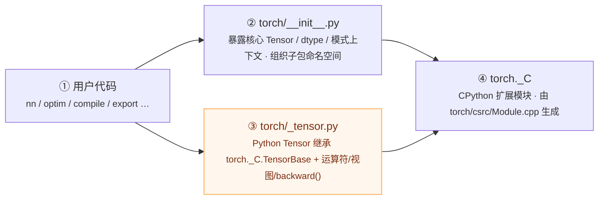

# PyTorch Python 顶层包结构

## 一句话理解

> `torch` 顶层包以 `torch/__init__.py` 为入口，向下分层为 "核心类型 → 设备/IO/随机性工具 → 高层子系统（nn/optim/autograd/distributed）→ 编译/导出栈（jit/fx/_dynamo/_inductor/export）"，其中 `torch._C` 是 C++ 扩展模块的 Python 锚点，所有计算最终下沉到它。

## 为什么重要

Python 侧是用户接触 PyTorch 的第一界面。理解包结构能帮你快速定位 API 归属（某个函数在 `torch` 还是在 `torch.nn.functional`？某个优化器在 `torch.optim` 的哪个文件？），并理解 `torch.compile`、`torch.export` 等新栈与 `torch.jit` 旧栈在包层级如何共存。同时，懒加载机制（`_dynamo`/`_inductor`/`_export`/`onnx` 经 `__getattr__` 按需导入）是控制启动时间的关键工程手段。

## 核心概念

### 顶层包入口

`torch/__init__.py` 是顶层包入口，暴露核心类型与功能。它的职责是把 C++ 扩展 `torch._C` 的底层对象包装成 Python 友好的 API，并组织各子包命名空间。

### 顶层包暴露的主要内容（按职能分组）

| 职能 | 暴露内容 |
| ---- | ---- |
| **核心类型** | `Tensor`、`SymInt`/`SymFloat`/`SymBool`（符号整数，用于动态形状）、`TypedStorage`/`UntypedStorage` 及遗留类型化 storage/张量别名 |
| **梯度控制** | `no_grad`、`enable_grad`、`inference_mode`、`set_grad_enabled`（来自 `torch.autograd`） |
| **AMP / autocast** | `autocast`、`GradScaler`（来自 `torch.amp`） |
| **随机性** | `manual_seed`、`seed`、`initial_seed`、`get_rng_state`/`set_rng_state`（来自 `torch.random`） |
| **序列化** | `load`、`save`（来自 `torch.serialization`） |
| **确定性** | `use_deterministic_algorithms`、`are_deterministic_algorithms_enabled`、`set_deterministic_debug_mode` |
| **设备/类型配置** | `get_default_device`/`set_default_device`、`set_default_tensor_type`、`set_default_dtype`、`get/set_float32_matmul_precision` |
| **符号整数辅助** | `sym_float`、`sym_int`、`sym_max`、`sym_min`、`sym_sum`、`sym_not`、`sym_ite` |
| **编译/变换** | `compile`、`vmap`、`cond`、`export` |
| **DLPack 互操作** | `from_dlpack`、`to_dlpack`（来自 `torch.utils.dlpack`） |

此外，`functional`、`_VF`（代理 `torch._C._VariableFunctions` 以绕过 mypy）、`ops`（命名空间）、`classes`、`return_types`、`library`（自定义算子注册）、`compiler`、`fx`、`export` 也是公共名称。

**懒加载模块**（通过 `__getattr__` 按需导入，避免拖慢启动）：`_dynamo`、`_inductor`、`_export`、`onnx`。

### 关键根级文件

| 文件 | 作用 |
| ---- | ---- |
| `torch/_tensor.py` | `Tensor` 类定义（Python 包装 `torch._C.TensorBase`），实现算术运算符、索引、视图、类型转换、`backward()`、`to()`、`cuda()`、`requires_grad_()` |
| `torch/functional.py` | 顶层函数式算子：`broadcast_tensors`、`einsum`、`meshgrid`、`stft`/`istft`、`lu`、`norm`、`cdist`、`tensordot`、`unique`、`split` 等 |
| `torch/_VF.py` | 代理模块，把 `torch._C._VariableFunctions` 暴露为 `torch._VF.<name>` |
| `torch/overrides.py` | `__torch_function__` 协议支持（`handle_torch_function`、`has_torch_function`） |
| `torch/library.py` | 自定义算子注册 API（`torch.library.Library`、`define`、`impl`） |
| `torch/hub.py` | 从 GitHub 加载预训练模型 |
| `torch/__future__.py` | 未来行为开关 |
| `torch/types.py` | 类型别名（`Device`、`_size`、`_TensorOrTensors` 等） |

## 工作原理

### 主要 Python 子包（按职能归类）

**训练核心三件套**：

| 子包 | 职责 |
| ---- | ---- |
| `torch.nn` | 神经网络层、`Module` 基类、`Parameter`/`Buffer`、函数式算子（`F`）、初始化、梯度工具、`DataParallel` |
| `torch.optim` | 优化器（SGD、Adam、AdamW、Adagrad、LBFGS 等）、LR 调度器、SWA |
| `torch.autograd` | 自动微分、`Function` API、grad 模式上下文、gradcheck、异常检测 |

**设备与后端**：

| 子包 | 职责 |
| ---- | ---- |
| `torch.cuda` | CUDA 张量、stream、event、内存、NCCL、CUDA graph、AMP scaler、profiling |
| `torch.mps` / `torch.mtia` / `torch.xpu` | Apple MPS / MTIA / Intel XPU 设备绑定 |
| `torch.accelerator` | 设备无关的加速器抽象 |
| `torch.backends` | 各后端（cudnn/mkl/mkldnn/openmp）开关与特性查询 |

**数学运算命名空间**（对 C++ 内置的薄文档包装）：

| 子包 | 职责 |
| ---- | ---- |
| `torch.fft` | 离散傅里叶变换（包装 `torch._C._fft`） |
| `torch.linalg` | NumPy 风格线性代数（`LinAlgError`、solve/eig/svd/qr/cholesky） |
| `torch.signal` | 信号处理（当前暴露 `windows` 子模块） |
| `torch.special` | 特殊数学函数（Bessel、erf、gamma、多项式） |
| `torch.sparse` | 稀疏张量算子 |

**编译/导出栈**（新旧并存）：

| 子包 | 职责 |
| ---- | ---- |
| `torch.jit` | TorchScript（旧栈）：`script`/`trace`、`ScriptModule`、IR、序列化、冻结、融合、移动端运行时 |
| `torch.fx` | 符号追踪 → Graph IR → 代码生成；编译/量化/export 的变换 pass |
| `torch._dynamo` | TorchDynamo：PEP 523 字节码帧钩子捕获 FX 图（新栈入口） |
| `torch._inductor` | TorchInductor：默认 `torch.compile` 后端，FX 图 → Triton/C++ 内核 |
| `torch.export` | AOT 捕获为 `ExportedProgram` IR（FX graph + 签名 + 动态形状） |
| `torch.onnx` | ONNX 模型导出，按 opset 符号函数；懒加载 |

**分布式与并行**：

| 子包 | 职责 |
| ---- | ---- |
| `torch.distributed` | 多进程/多节点训练、进程组、DDP/RPC/FSDP、collective、`torchrun` |

**数据与工具**：

| 子包 | 职责 |
| ---- | ---- |
| `torch.utils` | 数据加载（DataLoader/Dataset）、基准测试、cpp 扩展、DLPack、checkpoint、PyTree、sympy、TensorBoard、环境收集 |
| `torch.amp` / `torch.ao` | 自动混合精度 / 量化（`torch.ao.quantization` 使用 FX 图） |
| `torch.quantization` | 量化工具（旧入口） |
| `torch.hub` / `torch.distributions` / `torch.futures` / `torch.nested` / `torch.quasirandom` / `torch.masked` / `torch.testing` | 预训练模型加载、概率分布、异步 future、嵌套张量、低差异序列、掩码张量、测试工具 |

### 包层级的下沉路径

Python 侧 API 的最终归宿是 C++ 扩展模块 `torch._C`：

> **算子下发路径**：`torch.some_op()` → `torch/_VF.py`(代理 `_VariableFunctions` 绕过 mypy)→ `torch._C` → ATen Dispatcher → native 内核。`Tensor` 方法(`.cuda()`、`.requires_grad_()`、`.to()`、`.backward()`)直接由 `torch/_tensor.py` 掉到 `_C.TensorBase` 的 C++ 实现。

`Tensor` 类（`torch/_tensor.py`）继承 `torch._C.TensorBase`，在 Python 层补充算术运算符、索引、视图、`backward()` 等方法；算子的实际计算经 `_VF` 或 `torch._C._VariableFunctions` 下沉到 ATen 分发器。

## 我的理解

- **`torch/__init__.py` 是 "门面" 而非 "实现"**：它大量做 re-export 与命名空间组织，真正的计算在 C++ 侧。这也是为什么 PyTorch 的 Python 启动仍有开销——`__init__.py` 要 import 大量子包，懒加载（`_dynamo` 等）正是为缓解这一点。
- **`_VF` 的存在是个历史工程细节**：纯粹为绕过 mypy 对 `torch._C._VariableFunctions` 的类型检查（GH-21478），却成了理解算子下发路径的关键线索。
- **新旧编译栈在包层级 "井水不犯河水"**：`torch.jit`（旧）与 `torch._dynamo`/`torch._inductor`（新）是两个独立子包，`torch.compile` 只是 `torch.__init__` 暴露的便捷入口。这种隔离让用户可按需选择，也方便新栈逐步替代旧栈而不破坏兼容。
- **数学命名空间（fft/linalg/special）是对 C++ 内置的薄包装**：说明这些算子的实现已在 ATen，Python 侧只负责文档化与命名规范化（向 NumPy API 靠拢）。
- **`torch.utils` 是个 "杂物间" 但有金矿**：DataLoader、cpp_extension、PyTree、checkpoint 都在这里，是工程实践中高频使用的工具，不应因名字低调而忽视。

## Related

- [PyTorch 项目概述](./pytorch-overview/)
- [PyTorch 整体架构](./pytorch-architecture/)
- [C++ 核心模块](./pytorch-cpp-core/)

## References

- 源码仓库 `pytorch-main`，版本 `2.9.0a0`
- `torch/__init__.py`（顶层包入口）
- `torch/_tensor.py`（`Tensor` 类定义）
- `torch/_VF.py`（`_VariableFunctions` 代理模块）
