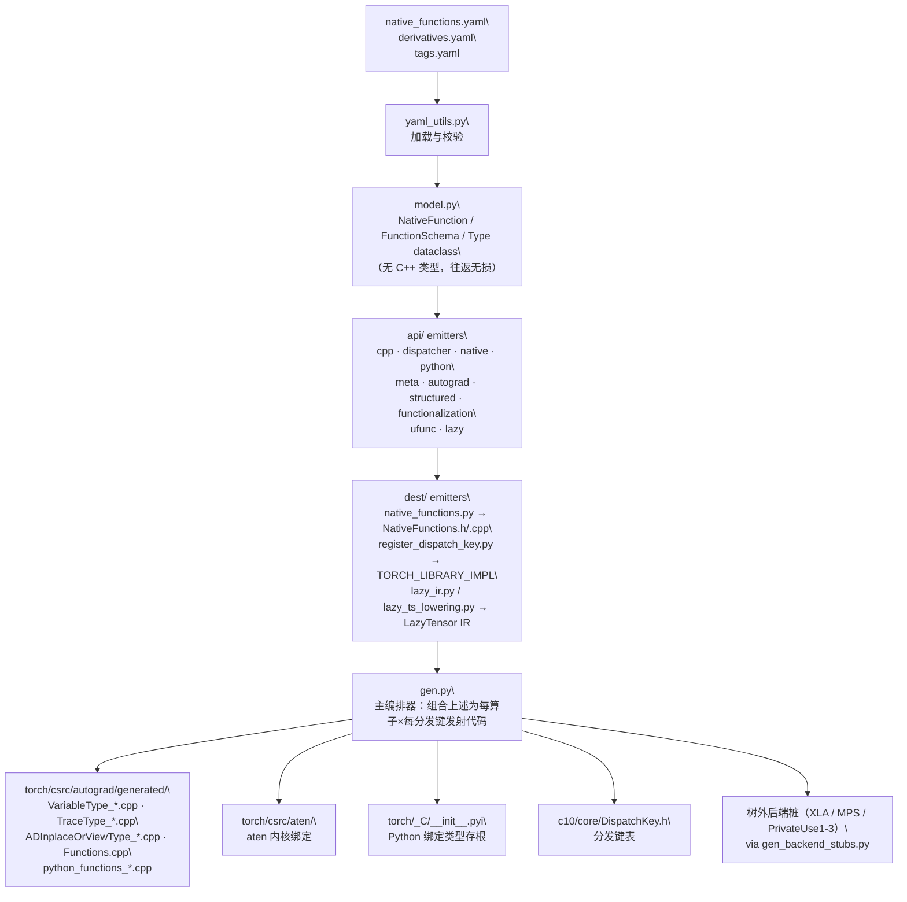

# PyTorch 代码生成系统 torchgen

## 一句话理解

> torchgen 是 PyTorch 的构建时代码生成器：把声明式的算子 schema（YAML）翻译成 C++ 内核定义、分发注册、autograd 公式、Python 绑定与后端桩——一条 YAML 条目即可生成原本需要手编数十个文件的代码。

## 为什么重要

PyTorch 有数千个原生算子，每个算子又需要覆盖 CPU、CUDA、Meta、Autograd、Composite、Functionalization、Lazy、Python 等多个分发键。如果全靠手写，添加一个算子就要在几十个文件里同步修改，极易出错且难以保持一致。

torchgen 把这件事变成**声明式**的：开发者只在 `native_functions.yaml`（算子 schema）和 `derivatives.yaml`（autograd 导数公式）里写一次，构建时 torchgen 自动生成所有胶水代码。它本质上是算子 schema 与生成的 C++/Python 之间的**契约层**——分发器、autograd、Python `torch._C` 绑定都依赖它。

它也服务树外后端扩展：XLA、MPS、PrivateUse1-3 等自定义后端可通过 `gen_backend_stubs.py` 从同一份 YAML 生成自己的分发桩，复用同一套 schema。

## 核心概念

### 两个事实来源（Single Source of Truth）

| YAML 文件 | 声明内容 |
| ---- | ---- |
| `aten/src/ATen/native/native_functions.yaml` | 所有原生算子的 schema、variant（function/method）、分发键、structured 标志 |
| `tools/autograd/derivatives.yaml` | autograd 导数公式（反向节点的梯度计算） |

### 目录职责

| 路径 | 职责 |
| ---- | ---- |
| `torchgen/gen.py` | 主入口编排器，组合各 emitter 产出内核定义、分发注册、autograd 公式、Python 绑定、vmap plumbing、functionalization 内核 |
| `torchgen/model.py` | 核心数据模型（`NativeFunction`、`FunctionSchema`、`OperatorName`、`Argument`、`Type`、`DispatchKey`、`BackendIndex`、`BackendMetadata` 等）；故意避免 C++ 类型作为内部表示，使用 dataclass 与强语义不变量（往返无损、不可变） |
| `code_template.py` | 通用模板引擎（`with_native_function` / `method_with_native_function`） |
| `context.py`、`local.py` | 基于 native function 的代码生成上下文管理器 |
| `yaml_utils.py` | YAML 加载辅助 |
| `utils.py` | `NamespaceHelper`、`OrderedSet` 等 |
| `native_function_generation.py` | 从 native spec 生成复合 `functional` / `out` 内核 |
| `torchgen/gen_backend_stubs.py` | 为自定义后端（XLA、MPS 等）生成分发桩 |
| `gen_lazy_tensor.py` | LazyTensor 后端代码生成 |
| `gen_aoti_c_shim.py` | AOT-Inductor C shim 代码生成 + 静态分发签名 |
| `gen_functionalization_type.py` | Functionalization 内核与 view-inverse 声明 |
| `gen_vmap_plumbing.py` | 算子的 vmap plumbing |
| `api/` | 按目标的 emitter：`cpp.py`（C++ `at::` 签名）、`dispatcher.py`（dispatcher box 签名）、`native.py`（native 内核签名）、`python.py`（Python 参数解析）、`meta.py`（meta 内核）、`autograd.py`（autograd 包装）、`structured.py`（跨 out/inplace/functional 共享 impl 的结构化内核）、`functionalization.py`（view-copy 内核）、`ufunc.py`（向量化 ufunc）、`lazy.py`（LazyTensor IR） |
| `dest/` | 按目标的发射器：`native_functions.py`（`NativeFunctions.h/.cpp`）、`register_dispatch_key.py`（每后端 `TORCH_LIBRARY_IMPL` 注册）、`lazy_ir.py` / `lazy_ts_lowering.py`（LazyTensor IR） |
| `decompositions/gen_jit_decompositions.py` | JIT 分解代码生成 |
| `operator_versions/gen_mobile_upgraders.py` | 移动端算子升级器 |
| `selective_build/` | 选择性算子注册（移动端体积缩减） |
| `shape_functions/gen_jit_shape_functions.py` | JIT 形状函数注册 |
| `fuse/gen_patterns.py` | 融合模式代码生成 |
| `aoti/fallback_ops.py` | AOTI 回退算子列表 |
| `_autoheuristic/` | matmul 启发式离线训练管线，产出 `_MMRankingA100.py` / `_MMRankingH100.py` 供 Inductor 运行时使用 |

### 设计要点：model.py 为何不用 C++ 类型

`model.py` 故意把 `NativeFunction`、`FunctionSchema`、`Type` 等建模为纯 Python dataclass，**不直接对应 C++ 类型**。这样做的好处是：

- **往返无损**：schema 可以序列化回 YAML 而不丢信息，便于校验与回归测试。
- **目标无关**：同一份模型可被 `api/cpp.py`、`api/python.py`、`api/dispatcher.py` 等不同 emitter 各自翻译，互不污染。
- **强不变量**：dataclass 不可变，避免生成过程中意外修改 schema。

## 工作原理

### 代码生成管线

torchgen 把"声明"逐步翻译成"目标代码"，分四个阶段：

阶段解释：

1. **YAML 声明**：`native_functions.yaml` 列出每个算子的 schema、variant、分发键、structured 标志；`derivatives.yaml` 声明 autograd 导数公式。
2. **解析为模型**：`model.py` 把 YAML 解析为 `NativeFunction` 对象（含 `FunctionSchema` / `Type` 树），此时还没有任何 C++ 类型。
3. **api/ 翻译签名**：`api/` 模块把模型翻译为目标特定签名——C++ 签名、dispatcher box 签名、native 内核签名、Python 参数解析、meta 内核、autograd 包装、结构化内核、functionalization、ufunc、LazyTensor IR。
4. **dest/ 发射注册**：`register_dispatch_key.py` 为每个后端发射 `TORCH_LIBRARY_IMPL` 注册；`native_functions.py` 发射 `NativeFunctions.h/.cpp`；`lazy_ir.py` / `lazy_ts_lowering.py` 发射 LazyTensor IR。
5. **gen.py 编排**：组合上述为每个算子与相关分发键发射内核定义、分发注册、autograd 公式、Python 绑定、vmap plumbing 与 functionalization 内核。
6. **产物落盘**：输出馈入 `torch/csrc/autograd/generated/`、`torch/csrc/aten/`、`torch/_C/__init__.pyi`，以及 `c10/core/DispatchKey.h` 中的分发表。

### 树外后端如何复用

自定义后端（XLA、MPS、PrivateUse1-3）不修改 PyTorch 源码，而是通过 `gen_backend_stubs.py` 从同一份 `native_functions.yaml` 读取算子 schema，生成自己后端的分发桩。这意味着新算子在主仓库一声明，所有树外后端都能立刻获得桩代码，只需再补内核实现。

## 我的理解

torchgen 体现了一种典型的**声明式 + 单一事实来源**工程哲学：

- **声明一次，生成多处**：算子的 schema 只写一遍，但会被翻译成 C++ 头、native 内核、dispatcher 注册、autograd 包装、Python 绑定、functionalization、vmap、LazyTensor IR 等十几种产物。手工维护这些产物的同步是不现实的。
- **构建时 vs 运行时**：torchgen 只在构建时（或树外后端扩展时）运行，产物是静态的 C++/Python 源文件。这与 Dynamo/Inductor 的运行时 JIT 形成对比——后者捕获用户代码生成内核，前者从 schema 生成框架胶水。
- **model.py 的抽象边界**：把 schema 解析与代码发射解耦，是这套系统能扩展到十几个 emitter 而不失控的关键。如果 model.py 直接产出 C++ 字符串，每个 emitter 都要重新理解 schema 语义，复杂度会爆炸。
- **与新编译栈的关系**：`torch.compile`（Dynamo + Inductor）走的是 FX 图 → Triton/C++ 内核的路径，**不经过 torchgen**。torchgen 生成的是 eager 路径的算子绑定与分发胶水；Inductor 则把算子 lowering 成自己的 IR 再 codegen。两者是并行的代码生成栈，服务不同场景。

一个直观的对比：如果没有 torchgen，添加一个新算子 `foo`，你需要手写——`at::native::foo` 的 CPU/CUDA 内核、`TORCH_LIBRARY_IMPL` 注册、`torch::autograd::foo_backward`、Python `torch.foo` 绑定与参数解析、functionalization 的 view-copy 版本、vmap 的 batched 规则…… torchgen 把这些全部收敛成一条 YAML + 一份导数公式。

## Related

- [整体架构](./pytorch-architecture/) — torchgen 生成的代码如何填入五层分层架构、分发机制
- [C++ 核心模块](./pytorch-cpp-core/) — torchgen 产物落点（c10、ATen、torch/csrc）
- [自动微分 autograd](./pytorch-autograd/) — `derivatives.yaml` 与生成的 `VariableType_*.cpp` 的下游
- [构建与运行](./pytorch-build-run/) — torchgen 在构建时由 `caffe2/CMakeLists.txt` 与 `tools/setup_helpers/generate_code.py` 触发
- [依赖关系](./pytorch-dependencies/) — torchgen 是构建时依赖，不进入运行时

## References

- 源码：`torchgen/` 目录，入口 `torchgen/gen.py`
- 算子 schema：`aten/src/ATen/native/native_functions.yaml`
- autograd 公式：`tools/autograd/derivatives.yaml`
- 构建触发：`caffe2/CMakeLists.txt` 与 `tools/setup_helpers/generate_code.py`
- 树外后端扩展：`torchgen/gen_backend_stubs.py`
