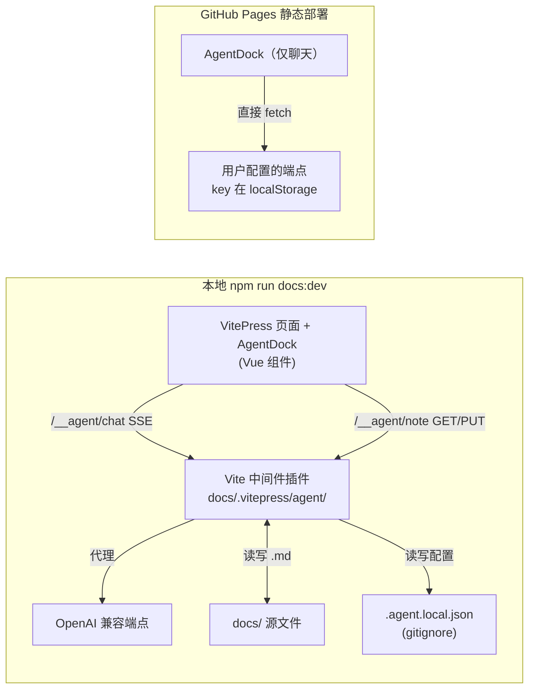

# VitePress 页面内 Agent 对话框（聊天 + 编辑笔记）迭代方案

## 一句话理解

把 second brain 从"只读知识库"升级为"可对话、可被 AI 直接编辑的知识库"：在 VitePress 每个页面右下角加一个浮动 agent 对话框，**选中文字即可带着上下文提问**；agent 在对话中产出改写后的完整笔记，用户 **预览 diff → 确认 → 直接写回 docs/ 源文件**，VitePress HMR 立即刷新。

> 本文是**待实施的迭代方案**（2026-09-06 决策记录），不是已完成功能的说明。落地后把本文 `status` 更新为 `implemented` 并记录验证结论。

## 为什么值得做

- 现有闭环是"在 IDE 里让 TRAE/Claude Code 改笔记"，本方案让**浏览知识时**也能随手提问、顺手修正，降低"理解→修正"的心智切换成本
- "选中内容对话"解决了 AI 工具最常见的痛点：不用复制粘贴大段上下文
- "对话内改写→应用"把 AI 产出放回**人工确认的闸门**（先 diff 再写盘），符合 AGENTS.md "Markdown 是源真理、AI 是助手"的原则
- 与站内既有 AI 源码笔记（nanobot 等）互补：本方案是"站点侧"的 agent 集成，可先用手写轻量实现，后续再决定是否复用 nanobot gateway

## 已确认的决策（2026-09-06 讨论结论）

| 维度 | 决策 | 说明 |
|---|---|---|
| 运行形态 | **本地可写 + 线上可聊** | 本地 `npm run docs:dev` 可编辑写盘（源真理在 docs/）；GitHub Pages 线上版保留对话框但仅聊天 |
| LLM 后端 | **OpenAI 兼容 API**（自备 baseURL + key） | 本地 key 存 `.agent.local.json`（gitignore）由 dev server 代理；线上 key 存浏览器 localStorage，需服务端允许 CORS |
| 编辑交互 | **对话内改写 → 应用** | agent 输出完整笔记（含 frontmatter）于 fenced 块 → 前端展示行级 diff → 用户确认 → PUT 写盘 → HMR 刷新 |
| 编辑写回 | **仅本地 dev** | GitHub Pages 是纯静态，无法写盘；线上只读聊天，编辑按钮在非本地模式隐藏 |
| 不做（本期） | 线上写回、页内 inline 所见即所得编辑器、git commit 按钮 | 留作后续迭代候选 |

## 架构总览



要点：

- **同一个 AgentDock 组件**在本地/线上都能跑；启动时先探测 `/__agent/health`（本地中间件存在且返回 `mode:'local'`），失败则退化为在线模式
- **本地模式**：聊天与笔记读写都走 `/__agent/*` 中间件，API key 不出本机
- **在线模式**：隐藏"写盘/应用"入口，聊天直接调用浏览器配置的 OpenAI 兼容端点（CORS 由该端点/网关决定）

## 端点设计（本地 dev 中间件，前缀 `/__agent`）

| 方法 & 路径 | 用途 | 请求/响应要点 |
|---|---|---|
| GET `/health` | 前端探测运行模式 | 返回 `{ok, mode:'local', writable:true, hasKey, baseUrl, model}` |
| GET `/config` | 读取 LLM 配置（不含 key） | `{baseUrl, model, hasKey}` |
| PUT `/config` | 保存 LLM 配置 | body `{baseUrl?, apiKey?, model?}`，apiKey 空串=清除；写入 `.agent.local.json` |
| GET `/note?rel=...` | 读取当前笔记源文件 | `rel` 为相对 `docs/` 的路径（如 `knowledge/ai/index.md`） |
| PUT `/note` | 写回笔记源文件 | body `{rel, content}`；仅本地模式提供 |
| POST `/chat` | SSE 代理 chat/completions | 转发 `messages/model`，上游 SSE 流式透传 |

安全边界（中间件实现时必须遵守）：

- `resolveNote`：只接受 `.md`、拒绝绝对路径与 `..` 穿越，解析后必须仍在 `docsRoot` 内
- 配置读写与笔记写回**仅存在于 dev 中间件**，不进入构建产物；线上静态站没有这些端点
- API key 只写 `.agent.local.json`（加入 `.gitignore`），或读环境变量 `AGENT_LLM_BASE_URL/AGENT_LLM_API_KEY/AGENT_LLM_MODEL`

## 建议的文件落点（待实施时创建）

```text
docs/.vitepress/
├── agent/
│   └── local-server.ts        # Vite 插件：/__agent 中间件（上述端点）
├── theme/
│   ├── index.ts               # extends DefaultTheme，在 layout-bottom 挂 AgentDock
│   ├── agent/
│   │   ├── AgentDock.vue      # 浮动对话框：会话/流式/设置/选中内容入口
│   │   ├── DiffPanel.vue      # 行级 diff 预览 + 「应用/取消」
│   │   ├── api.ts             # health/config/note/chat(SSE) + 在线降级逻辑
│   │   ├── diff.ts            # 轻量行级 LCS diff（避免新依赖）
│   │   └── md.ts              # agent 回复轻渲染 + fenced 完整笔记提取
│   └── custom.css             # 对话框/悬浮选中按钮样式
└── config.mts                 # vite: { plugins: [secondBrainAgentPlugin()] }
```

约束：**不新增 npm 依赖**（SSE 用 fetch reader、diff 用自写 LCS），避免依赖安装不确定性。

## 功能拆解与验收（里程碑）

### M0 · 决策与脚手架
- 重读本文，确认形态与端点契约；确定 base 路径处理（本地 `/`，线上 `/second-brain/`）
- 验收：本文 `status` 保持 `seed`；在仓库提交一个空 commit 前的代码基线上开工

### M1 · 本地中间件（后端）
- 实现 `local-server.ts` 全部端点；`config.mts` 挂 `vite.plugins`；`.gitignore` 加 `.agent.local.json`
- 验收（`npm run docs:dev` 后手动 curl/浏览器）：
  - GET `/__agent/health` 返回 `mode:'local'`
  - PUT `/__agent/note` 写入后 `docs/` 源文件立即变化且 HMR 刷新
  - 路径穿越（`../`、绝对路径、非 .md）被拒绝
  - `docs:build` 不受中间件影响（apply:'serve'）

### M2 · 对话框骨架（前端）
- `theme/index.ts` 在 `layout-bottom` slot 注入 `AgentDock`；浮动按钮/面板、消息列表、流式渲染、本地/在线模式探测与顶部状态徽标、设置面板（baseUrl/model/key）
- 验收：本地与线上（GitHub Pages 或 `docs:preview`）都能打开面板；在线模式隐藏编辑入口；错误（无 key、CORS、上游 4xx）有明确提示而非静默

### M3 · 选中内容对话 + 上下文
- 页面选中文字出现浮动按钮 → 打开对话框并携带选区；发送时可勾选"附上当前笔记全文（本地取源 md / 在线取可见文本，截断）"
- system prompt 遵守 AGENTS 核心规则（区分事实/个人理解、LaTeX、不臆造链接），当前笔记 rel 路径一并作为上下文
- 验收：任意 knowledge 页面选中一段 → "解释/找矛盾/联系其他笔记"能给出引用该段内容的回答

### M4 · 改写 → diff → 应用（闭环）
- 指令约定：agent 若要产出可应用的编辑，须输出**完整文件**（含 frontmatter）于 ` ```markdown ` fenced 块；前端提取唯一块 → `DiffPanel` 对比 `GET /note` 原始内容 → 「应用」后 `PUT /note`
- 应用成功后提示"已写盘，HMR 刷新中"；若 agent 回复不含完整文件则按钮不出现
- 验收：在本地对任意知识页执行"帮我改写 XX 章节"，diff 准确、应用后页面内容与源文件一致

### 后续候选（本期不做）
- 线上写回：GitHub Contents API + PAT（直接 commit 或开 PR）
- git commit 入口：应用写盘后一键生成有意义的 commit（需在中间件外再处理 git 操作与凭据）
- 页内 inline markdown 编辑器与 agent 建议面板并列
- 多会话持久化（按笔记 rel 存 localStorage）、会话导出

## 风险与开放问题

- **在线聊天 CORS**：并非所有 OpenAI 兼容端点允许浏览器跨域直连；线上体验取决于所用网关。缓解：README 说明需选 CORS 允许的端点/自建网关，或后续做 Serverless 代理（Vercel/Cloudflare Worker）
- **长笔记 token 成本**：全文上下文需截断与折叠策略（只附"命中章节"？），避免每次提问都发送整篇
- **fenced 块歧义**：agent 回复若含多个 ``` 块或把 LaTeX/代码也包进 fenced，需明确解析规则（取最后/最大一块，且语言标签为 markdown）
- **误写风险**：写盘前必须 diff + 确认，且建议中间件记录每次 PUT 前的备份或依赖 git 回滚
- **与 VitePress 版本兼容**：`layout-bottom` slot 在 vitepress ^1.6 可用；升级需回归
- 是否复用 nanobot gateway（`/v1/chat/completions`）作为默认 baseUrl，值得在实施时与本仓库 nanobot 源码笔记对照决定

## Related Knowledge

- [Second Brain 迭代路线图](../docs/projects/second-brain-iteration-roadmap.md) — 本文是其中"阶段三 AI 深化/站内交互"的一个具体落地候选
- [nanobot 源码精读笔记](../docs/knowledge/ai/systems/nanobot/) — 若决定复用其 gateway 或参考其 WebUI 消息流实现，从这里对照架构
- [AGENTS.md](../AGENTS.md) — system prompt 与写回纪律（源真理、原子笔记、导航注册）须与之一致
- [部署工作流](../.github/workflows/deploy.yml) — 线上为 GitHub Pages 静态部署，决定了"线上只读"边界
